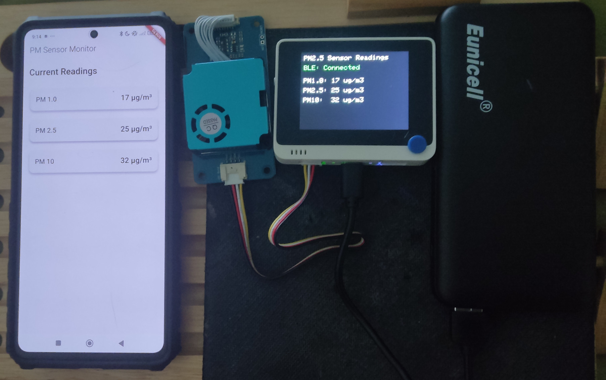

# Flutter PM2.5 Monitor App

A Flutter mobile application that connects to a PM2.5 sensor via Bluetooth Low Energy (BLE) to monitor air quality measurements in real-time.



## Features

- Real-time monitoring of PM1.0, PM2.5, and PM10 particulate matter concentrations
- Bluetooth Low Energy (BLE) connectivity
- Clean Material Design 3 UI
- Permission handling for BLE and location services
- State management using Provider

## Platform Support
| Android |  iOS  | MacOS |  Web  | Linux | Windows |
| :-----: | :---: | :---: | :---: | :---: | :-----: |
|   ✅   |   ✅   |   ❌   |   ❌ |   ❌    |    ❌   |

## Requirements

- Flutter SDK ^3.6.1
- Android: minSdk 19
- iOS: iOS 12.0 or later
- Compatible PM2.5 sensor device with BLE support
    - [Grove PM2.5 Monitor BLE Project](https://github.com/IoT-gamer/grove-pm2_5-monitor-ble/tree/main)

## Dependencies

- [`flutter_blue_plus`](https://pub.dev/packages/flutter_blue_plus): ^1.35.2
- [`provider`](https://pub.dev/packages/provider): ^6.1.2
- [`permission_handler`](https://pub.dev/packages/permission_handler): ^11.3.1

## Getting Started

1. Ensure you have Flutter installed and set up properly
2. Clone this repository
3. Install dependencies:
```bash
flutter pub get
```
4. Run the app:
```bash
flutter run
```

## BLE Configuration

The app looks for a BLE device with the following specifications:

- Device Name: "PM2.5 Sensor"
- Service UUID: "91bad492-b950-4226-aa2b-4ede9fa42f59"
- Characteristics:
  - PM1.0: "91bad493-b950-4226-aa2b-4ede9fa42f59"
  - PM2.5: "91bad494-b950-4226-aa2b-4ede9fa42f59"
  - PM10: "91bad495-b950-4226-aa2b-4ede9fa42f59"

## Usage

1. Enable Bluetooth on your device
2. Launch the app
3. Grant necessary permissions when prompted
4. Press "Scan for Sensor" to find and connect to your PM2.5 sensor
5. Once connected, the app will display real-time readings for PM1.0, PM2.5, and PM10

## License

This project is licensed under the MIT License - see the LICENSE file for details.

